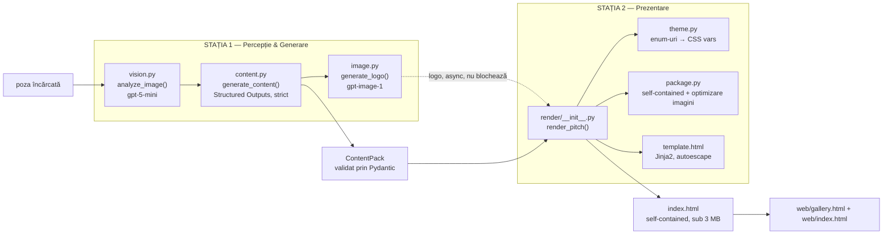
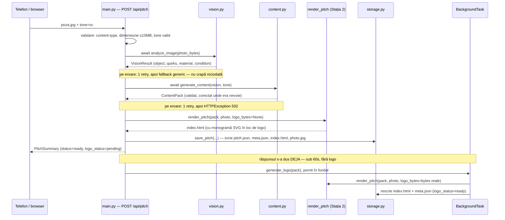

# Productify — tot proiectul, explicat

Document de referință pentru toată echipa: ce e aplicația, cum e construită, ce face fiecare
bucată din repo și în ce stare e acum. Nu e un ghid de "cum rulez" (ăla e în `README.md`) — e
explicația mecanicii, ca oricare dintre cei 4 să poată răspunde la orice întrebare despre orice
fișier, care e regula nescrisă a hackathon-ului ăstuia.

---

## 1. Ideea, în două fraze

O poză a unui obiect qualquer intră; iese o pagină HTML completă, de sine stătătoare, pentru o
companie *inventată* în jurul obiectului ăla — sub un minut. Un capsator zgâriat devine
"ClipWell — ultimul capsator de care ai nevoie vreodată". Fiecare pagină generată e salvată și
apare într-o galerie, descărcabilă ca un singur fișier `.html`.

## 2. De ce 2 stații, nu 4 oameni pe bucăți separate

Brief-ul descrie 4 pași înlănțuiți: Look → Invent → Brand → Publish. Dar pasul 4 — "un
template combină conținutul și tema într-un fișier HTML" — nu e un apel la model, e randare
pură, zero cost, zero latență de rețea. Deci împărțirea reală e:

| Pas | Ce e de fapt | Cine |
|---|---|---|
| 1. Look | apel vision (`gpt-5-mini`, multimodal) | **Stația 1** |
| 2. Invent | apel Structured Outputs (`gpt-5-mini`) | **Stația 1** |
| 3. Brand | apel imagine (`gpt-image-1`) | **Stația 1** |
| 4. Publish | template Jinja2 + temă → HTML | **Stația 2** |

Toate cele 3 apeluri la model într-un loc, toată randarea în celălalt. Beneficiu concret: cheia
OpenAI trăiește doar pe laptopul Stației 1 — laptopul Stației 2 rulează `MOCK=1` toată ziua și
nu poate arde bugetul de bani din greșeală, pentru că nu are cum să apeleze modelul.

## 3. Cusătura — un singur obiect, două fețe

Tot ce trece de la Stația 1 la Stația 2 e un singur obiect: `ContentPack`. Forma lui e
**îngheţată** în `contracts/content_pack.schema.json` — niciuna dintre stații nu o schimbă
unilateral.

**Fața 1 — în proces.** Cât timp serverul rulează, Stația 1 apelează direct funcția Stației 2:
```python
render_pitch(pack: ContentPack, photo_bytes: bytes, logo_bytes: bytes | None) -> str
```
Semnătura asta e îngheţată în `contracts/handoff.md`. E apelată **de două ori** per pitch: o
dată cu `logo_bytes=None` (pagina apare imediat), a doua oară din task-ul de fundal, când
logo-ul e gata — implementarea trebuie să fie sigură la apel repetat.

**Fața 2 — pe disc.** Stația 1 scrie `pitch.json` + `photo.jpg` + `logo.png` într-un folder pe
disc. Stația 2 poate reproduce exact același rezultat citind folderul ăla, **fără să ruleze un
singur rând din codul Stației 1** — asta e ce face posibil ca cele două laptoape să lucreze
independent toată ziua, transferând doar `fixtures/bundles/` prin git.

## 4. Arhitectura completă, ambele stații, așa cum e ACUM (nu mai e schiță)



Toate cele trei cutii din Stația 1 sunt **reale** acum — nu mai sunt stub-uri. La fel toată
cutia Stației 2: `render_pitch()` chiar randează prin Jinja2, `theme.py` chiar traduce cele 6
mood-uri în CSS diferit (spacing, umbre, alinierea hero-ului — nu doar culori), `package.py`
chiar comprimă poza la 1200px și logo-ul la 256px și verifică că rezultatul e cu adevărat
self-contained (`assert_self_contained(html)` — nicio cerere externă).

## 5. O cerere reală, pas cu pas, de la telefon la pagină



Linia cea mai importantă e "răspunsul s-a dus DEJA" — vine direct din must-have #1 ("sub 60 de
secunde"), și din faptul că `gpt-image-1` singur poate dura 10-30 de secunde.

## 6. Fișier cu fișier, tot repo-ul

```
productify/
├── CLAUDE.md                context comun pentru sesiunile Claude Code
├── README.md                cum se rulează + notele tehnice ale Stației 1
├── DEMO.md            [S2]  cine vorbește când, la demo — 5 minute + întrebări
├── .env.example              șablon; cheia reală nu iese niciodată din .env
│
├── contracts/                🔒 ÎNGHEȚATE — nimeni nu editează unilateral
│   ├── api.md                 forma exactă a fiecărui răspuns HTTP
│   ├── content_pack.schema.json  schema JSON, trimisă ca atare la Structured Outputs
│   └── handoff.md             cusătura S1↔S2 — semnătura + cele două fețe (secțiunea 3)
│
├── app/
│   ├── main.py          [S1]  ✅ toate rutele, cablate real; montează web/
│   ├── config.py        [S1]  ✅ .env, spend cap (can_call_image / note_image_call)
│   ├── models.py        [S1]  ✅ oglinda Pydantic a schemei — VisionResult, ContentPack...
│   ├── storage.py       [S1]  ✅ disc, fără DB — save_pitch, list_pitches, update_meta
│   ├── pipeline/
│   │   ├── vision.py     [S1]  ✅ Look — testat cu poză reală (secțiunea 8)
│   │   ├── content.py    [S1]  ✅ Invent — Structured Outputs, strict, un apel
│   │   ├── image.py      [S1]  ✅ Brand — gpt-image-1, în fundal, spend cap respectat
│   │   └── prompts.py    [S1]  ✅ TONE_BRIEFS (4 voci), toate prompt-urile de model
│   └── render/           [S2]
│       ├── __init__.py         ✅ render_pitch() — orchestrează theme+package+template
│       ├── theme.py            ✅ 6 mood-uri → CSS diferit structural, nu doar culori
│       ├── package.py          ✅ self-contained: poză/logo → data URI, verificare finală
│       └── template.html       ✅ Jinja2, autoescape pornit, 7 secțiuni
│
├── web/                  [S2]
│   ├── index.html              ✅ ecranul de captură (poză + alegere ton)
│   ├── gallery.html             ✅ galeria, cu polling pentru logo_status
│   └── static/{app,gallery,tones}.js, style.css   ✅ logica de frontend, fără framework
│
├── fixtures/
│   ├── stapler.{vc,luxury,infomercial,kickstarter}.json   pachete scrise de mână, pentru MOCK
│   ├── photos/floare.jpg        poza folosită să testăm vision.py cu date reale
│   └── bundles/                 ⏳ gol acum — T3 (al nostru) le exportă aici
│
├── eval/                 [S1]   ⏳ gol acum — T3 (export_bundle) și T5 (run_batch) urmează
└── out/                          gitignored — pitch-urile generate la runtime
```

Legendă: ✅ real și testat · ⏳ încă neîncepută, task viitor · 🔒 frozen.

## 7. Cum funcționează randarea, la Stația 2 (ca să înțelegeți și partea lor)

`render_pitch()` nu e un singur bloc de cod — orchestrează trei fișiere:

1. **`theme.py`** primește `pack.theme` (paletă + `font_pair` + `radius` + `mood`, toate deja
   validate de noi) și produce un dicționar de variabile CSS. Ideea centrală: `mood` nu
   schimbă doar culorile — schimbă *structura* (cât spațiu între secțiuni, cât de puternice
   sunt umbrele, cum e alinierea hero-ului). Așa ies patru pagini pe același ton vizual
   genuinely diferite, nu patru palete peste același layout.
2. **`package.py`** ia bytes bruți (poza, logo-ul) și le transformă în `data:` URI-uri,
   redimensionând poza la maximum 1200px și logo-ul la 256px, ca fișierul final să rămână sub
   3 MB. La final, `assert_self_contained(html)` verifică chiar în cod că nu a scăpat nicio
   cerere externă — un CDN, un link de Google Fonts — ceea ce ar sparge garanția "se randează
   cu rețeaua scoasă din priză".
3. **`template.html`** e un template Jinja2 clasic, cu `autoescape` pornit — obligatoriu, din
   moment ce fiecare string din pagină a fost scris de un model de limbaj și poate conține
   `<` sau ghilimele.

## 8. Ce e testat cu adevărat, cu date reale (nu doar cu fixture-uri)

Am rulat `analyze_image()` cu `MOCK=0`, cheie reală, pe o poză reală
(`fixtures/photos/floare.jpg`, o floare de plumeria cu picături de apă):

```json
{
  "object": "plumeria flower",
  "quirks": [
    "numerous round water droplets on petals, largest ~5 mm across",
    "thin grass blade lying across the right petal, tip pointing into the flower center",
    "bottom petal has a small triangular notch at its outer edge",
    "yellow-orange throat with a faint radial crease on the top petal"
  ],
  "material": "plant",
  "condition": "fresh"
}
```

Și am rulat toată aplicația în `MOCK=1`, pe toate cele 4 tonuri, pe același capsator:

| Ton | Brand | Tagline |
|---|---|---|
| vc | Clipwell | "The last stapler you'll ever have to onboard" |
| luxury | Maison Agrafe | "L'art de fixer." |
| infomercial | THE STAPL-INATOR 3000 | "YOU WON'T BELIEVE IT BINDS!!" |
| kickstarter | ReStaple | "One stapler. One story. Help us bring it..." |

Patru companii vizibil diferite pe același obiect — exact criteriul de succes din brief.

## 9. Ce nu e perfect încă (transparent, nu ascuns)

La un review de cod pe ce s-a integrat din `content.py`/`main.py`/`storage.py`, au apărut două
bug-uri confirmate prin rulare reală, nu doar teoretice:

1. Când modelul întoarce mai puține tarife de preț decât 3, completarea lor (prin duplicarea
   ultimului) creează accidental **aceeași referință de obiect** de mai multe ori, iar bucla
   care ar trebui să forțeze exact un tarif `highlighted: true` ajunge să lase **zero**
   tarife marcate. Violează garanția din `handoff.md` pe care Stația 2 se bazează fără
   verificare defensivă.
2. `pitch.json` (artefactul de pe disc, Fața 2 din secțiunea 3) rămâne cu `has_logo: false`
   permanent, chiar și după ce logo-ul real e generat și `logo.png` există pe disc — pentru
   că task-ul de fundal actualizează `meta.json`, dar nu și `pitch.json`.

Ambele au fix-uri mici, izolate în fișierele noastre (`content.py`, `storage.py`, `main.py`),
nu ating contractele îngheţate.

## 10. Ce urmează pentru noi (Stația 1)

| Task | Ce face |
|---|---|
| **T3** | `eval/export_bundle.py` — exportă 4 bundle-uri reale în `fixtures/bundles/` |
| **T5** | `eval/run_batch.py` — raport de calitate: quirk coverage, diferența reală dintre tonuri |
| **T6** | Rezistență la demo — nimic nu trebuie să dea 500, loguri de timp per etapă |

`eval/` și `fixtures/bundles/` sunt încă goale — astea sunt următoarele bucăți reale de scris.
