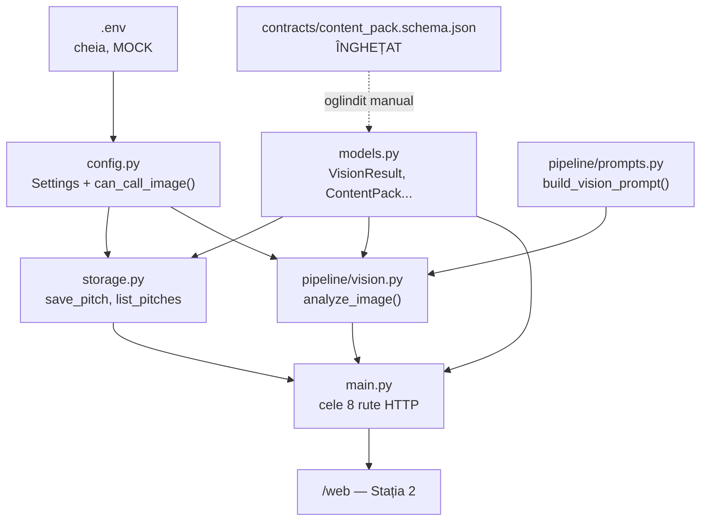
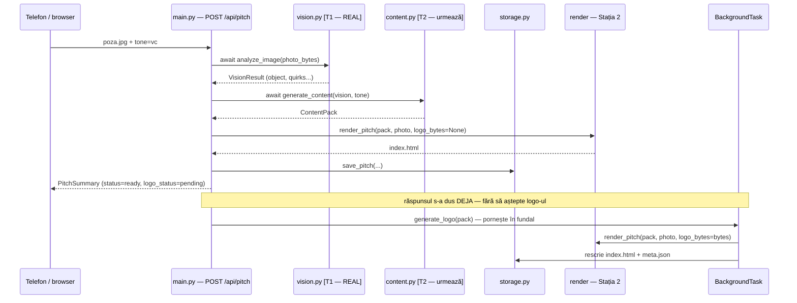
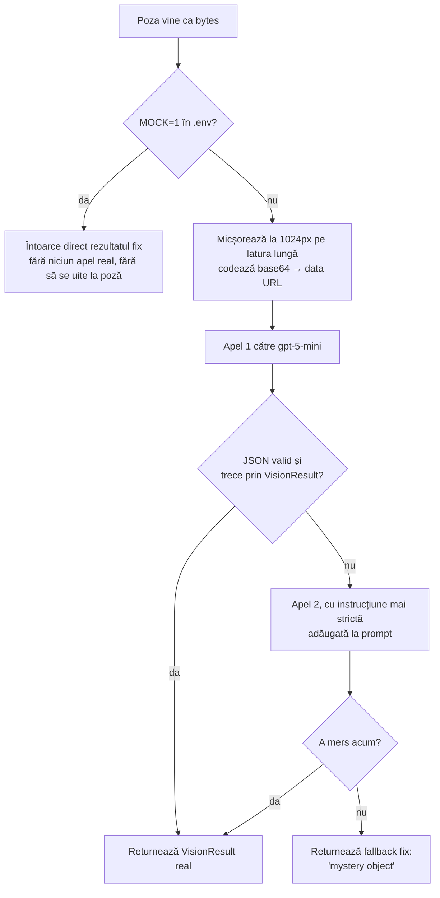

# Productify

A photo of any object goes in; a self-contained HTML pitch page for an invented company
comes out. See `CLAUDE.md` for context and `contracts/` for the frozen interfaces.

## Run

```bash
python3 -m venv .venv && source .venv/bin/activate
pip install -r requirements.txt
cp .env.example .env                    # then paste the key (Station 1 only)
MOCK=1 uvicorn app.main:app --reload    # development, no API calls
uvicorn app.main:app --reload           # real API calls
```

Then open http://localhost:8000/web/index.html — health check at
http://localhost:8000/health.

---

## Stația 1 — cum funcționează, de fapt

Nu doar "ce face fiecare fișier" — ci mecanica reală: cum se leagă piesele între ele, ce se
întâmplă pas cu pas când vine o cerere, și de ce e construit exact așa.

### 1. Cinci concepte, ca să înțelegi tot restul

**API web** — imaginează-ți un ghișeu. Clientul (telefonul, browserul) trimite o cerere HTTP
("aici e o poză, tone=vc, generează-mi un pitch"), serverul răspunde cu date, de obicei JSON.
FastAPI e biblioteca Python care ne dă ghișeul gratis — noi scriem doar funcții și le lipim pe
adrese.

**Rută / endpoint** — o adresă + o funcție care rulează când vine o cerere acolo. În
`app/main.py`:
```python
@app.get("/health")
async def health() -> dict:
    return {"ok": True, "mock": settings.MOCK}
```
`@app.get("/health")` înseamnă: "când vine un GET pe `/health`, rulează funcția `health()`
dedesubt." Restul rutelor din `main.py` sunt exact acest pattern, repetat de 8 ori.

**Pydantic = un polițist de formă pentru date.** Îi spui cum trebuie să arate un obiect (ce
câmpuri, ce tip), și el verifică automat, la fiecare rulare, dacă datele primite respectă
forma aia. Dacă vine ceva care nu se încadrează, aruncă o eroare clară imediat, în loc să lase
gunoiul să circule mai departe prin sistem și să pice altundeva, mai greu de depanat.
`app/models.py` e plin de clase Pydantic — fiecare e o "formă" impusă.

**`async` / `await`** — un fel de a-i spune lui Python: "cât timp aștept un răspuns de la
OpenAI (poate dura câteva secunde), nu bloca tot serverul — poate deservi alte cereri în
timpul ăsta." De-aia toate funcțiile din pipeline sunt `async def`, și le apelăm cu `await`.
Fără asta, un singur upload lent ar îngheța toată aplicația pentru toți ceilalți utilizatori
în același timp.

**Structured Outputs (la OpenAI)** — un mod special de a apela modelul în care îi dai o formă
exactă (o schemă JSON) și el e *obligat* să răspundă exact în forma aia, nu prozaic, nu cu
markdown în jur. E diferența dintre "te rog frumos dă-mi JSON" (ce facem noi la T1, pentru
vision) și "ești constrâns structural să dai exact asta" (ce vom face la T2, pentru
`ContentPack`).

### 2. Arhitectura pe straturi — cine depinde de cine



Observă direcția: `config.py` și `models.py` nu depind de nimic din proiectul nostru — sunt
fundația. Totul deasupra lor le citește. `main.py` e vârful — el importă din toate celelalte,
niciun alt fișier nu importă din `main.py`. Așa se explică și regula "Stația 2 nu deschide
niciodată `main.py`": e fișierul cu cele mai multe fire care intră în el, deci cel mai expus la
conflicte de merge dacă l-ar edita doi oameni simultan.

### 3. Ce se întâmplă, pas cu pas, la o cerere reală

Asta e arhitectura *țintă* — azi doar bucata de vision (V) e reală, restul sunt stub-uri
(T2/T4 urmează), dar fluxul e deja cablat așa în `main.py`:



Observă linia "Note": răspunsul către telefon se trimite **înainte** ca logo-ul să existe.
Asta e decizia arhitecturală cea mai importantă a stației noastre — vine din must-have #1,
"sub 60 de secunde", și `gpt-image-1` singur poate dura 10-30 de secunde.

### 4. Mecanismul de siguranță din `vision.py` — retry + fallback, ca flux



De ce exact un retry, nu zero și nu în buclă: modelele AI ocazional dau JSON stricat sau
timeout tranzitoriu — un retry prinde majoritatea acestor eșecuri trecătoare. Dar a insista la
infinit ar bloca cererea și ar arde timp și bani fără rost; restul eșecurilor se rezolvă prin
fallback, nu prin așteptare. Regula de aur din `CLAUDE.md` e literal asta: "demo-ul nu trebuie
să pice niciodată" — un rezultat generic bate un stack trace.

### 5. De ce e "stateless" storage-ul

`storage.list_pitches()` recitește directorul `out/pitches/` de pe disc **de fiecare dată**
când e apelat — nu ține o listă în memorie RAM care se actualizează la fiecare pitch nou. Motiv
mecanic, nu stilistic: FastAPI poate rula mai multe cereri *simultan* (asta e tot rostul lui
`async`). Dacă am ține o listă în memorie, două upload-uri simultane ar putea s-o corupă — una
scrie în listă cât cealaltă o citește, și rezultatul e nedefinit (o "race condition"). Citind
mereu direct de pe disc, fiecare cerere vede realitatea curentă, nu o copie care poate fi
stale sau coruptă. E prețul (puțin mai lent) pentru zero bug-uri de concurență, corect pentru
volumul unui hackathon de o zi.

### 6. Rezultatul real, ca dovadă că mecanismul de mai sus funcționează

Testat cu `fixtures/photos/floare.jpg` (o floare de plumeria cu picături de apă), `MOCK=0`,
cheie reală în `.env` — a mers din prima încercare, fără retry, fără fallback:

```json
{
  "object": "plumeria flower",
  "quirks": [
    "numerous round water droplets on petals, largest ~5 mm across",
    "thin grass blade lying across the right petal, tip pointing into the flower center",
    "bottom petal has a small triangular notch at its outer edge",
    "yellow-orange throat with a faint radial crease on the top petal"
  ],
  "material": "plant",
  "condition": "fresh"
}
```

Astea sunt exact pas 3-4 din diagrama de la secțiunea 4 (`D` → `E` → `F` da → `G`). Observă cât
de specifice sunt quirk-urile — un fir de iarbă care taie *o petală anume*, o crestătură pe
*altă* petală. Astea trebuie să reapară, reformulate, în copy-ul de marketing la T2.

### 7. Ce urmează, în ordine

| Task | Ce face | Status |
|---|---|---|
| **T2** | `generate_content()` — un apel Structured Outputs, `VisionResult` → `ContentPack` complet | ⏳ următorul |
| **T3** | `eval/export_bundle.py` — exportă 4 bundle-uri reale în `fixtures/bundles/` pentru Stația 2 | ⏳ |
| **T4** | `generate_logo()` — `gpt-image-1`, în `BackgroundTask`, exact ca în diagrama de la secțiunea 3 | ⏳ |
| **T5** | `eval/run_batch.py` — quirk coverage și diferența reală dintre cele 4 tonuri | ⏳ |
| **T6** | Rezistență la demo — nimic nu trebuie să dea 500 | ⏳ |

### 8. Reguli care nu se negociază

- Cheia OpenAI nu apare niciodată în chat, commit-uri sau loguri — vine doar din `.env`.
- Contractele (`contracts/*`) sunt îngheța­te — orice schimbare se discută, nu se editează.
- `app/render/*` și `web/*` nu sunt ale noastre după T0.
- Un apel de imagine per pitch, maximum — verificat de `config.can_call_image()`.
- Demo-ul nu pică niciodată — fiecare etapă are un fallback, ca în secțiunea 4.
